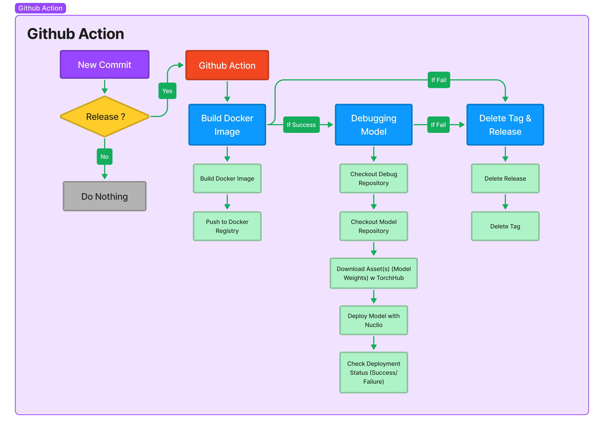

<div align="center">

# CVAT Model Registry Template

<a href="https://github.com/openvinotoolkit/cvat/tree/v2.1.0"></a>
<a href="https://github.com/nuclio/nuclio/tree/1.5.16"></a>

A template to kickstart cvat model deployment <br>
Click on [<kbd>Use this template</kbd>](https://github.com/ashleve/lightning-hydra-template/generate) to initialize new repository.

</div>

## 📌&nbsp;&nbsp;Introduction
The template can be used as a model registry for the model to be deployed to CVAT. This template contains several scripts (`main.py`, `model_handler.py`, `ci.yaml`, etc) you must customize according to the model used. This template also uses CI mechanisms to: build docker images; debug models in Nuclio; and delete GitHub releases when CI failure.



An example of using this template to develop a registry model can be seen on the branch:

- YOLOv5
- YOLOR
- DETR

## 🚀&nbsp;&nbsp;Quickstart
You can clone the repository and put the script dependency model in it. 
```bash
git clone https://github.com/ruhyadi/model-registry-cvat-template ./your_model
cd ./your_model

git clone https://github.com/username/your_model ./
```
You must configure three important scripts to deploy the model to cvat: `main.py`, `model_handler.py`, and `function.yaml`.

### Main Script (`main.py`)

`main.py` is a script used to initiate and inference models. Inside `main.py` there are two functions: `init_context` and `handler`.The `init_context` function initiates the model, while the `handler` function is used for the inference model. The goal of `main.py` is to generate a response as `json`.

The author has provided a `#TODO` that you can follow along:
1. In the `init_context` function, load `model` according to the load model function of `model_handler`.
2. In the `handler` function, change the message in `context.logger.info()`.
3. Set the desired threshold value (default: 0.5).
4. Change the inference model mechanism; the final result will be `results` which contains a dictionary (NOTE: for object detection task):
```yaml
results = {
    "confidence": 0.8,
    "label": "car",
    "xmin": 0.1,
    "ymin": 0.2,
    "xmax": 0.3,
    "ymax": 0.4,
    }
```

### Model Handler (`model_handler.py`)